# 宠物医院管理系统(文末免费领取☟)

#### 介绍
(SpringBoot+Vue)宠物医院管理系统  pet_hospital
有BUG可留言加微

#### 软件架构
Java + SpringBoot + mybatis + Vue + Mysql

#### 项目功能说明

系统分为管理员、医护人员、客户等角色，还可以添加其他角色
> + 预约管理
> + 宠物档案
> + 日常健康
> + 预约挂号
> + 医院管理：通知公告、报表生成、药品管理、宠物用药
> + 系统设置：用户管理、角色管理
> + 个人中心

### 部分功能演示
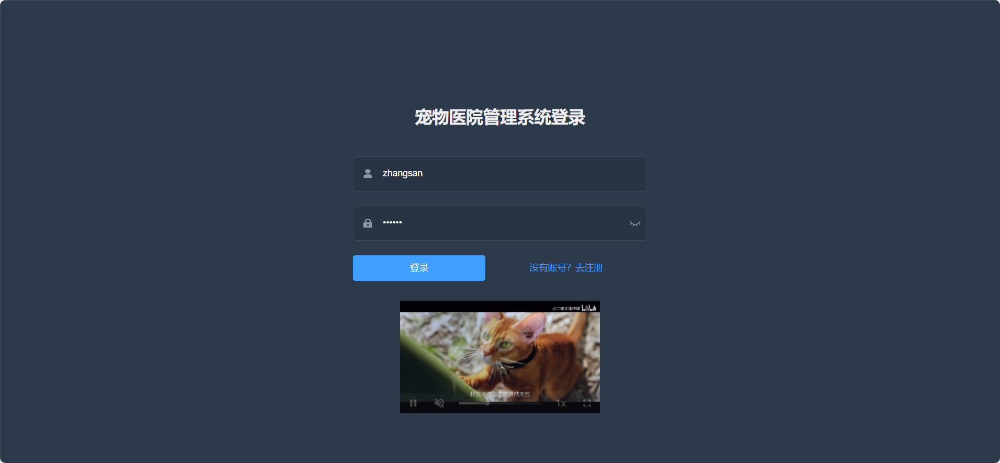
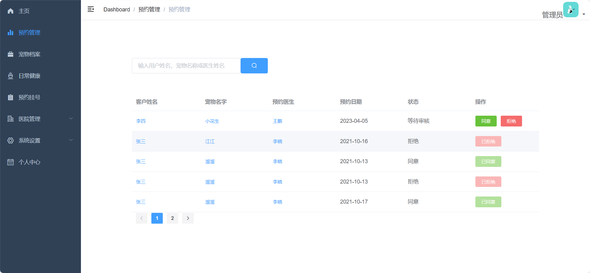
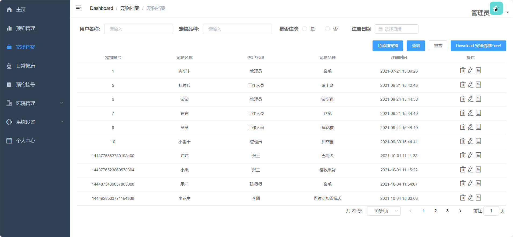
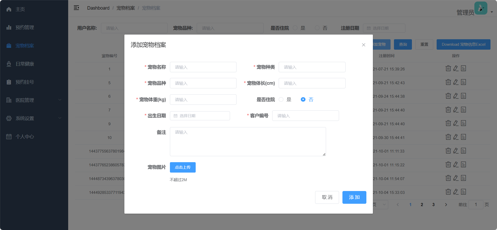
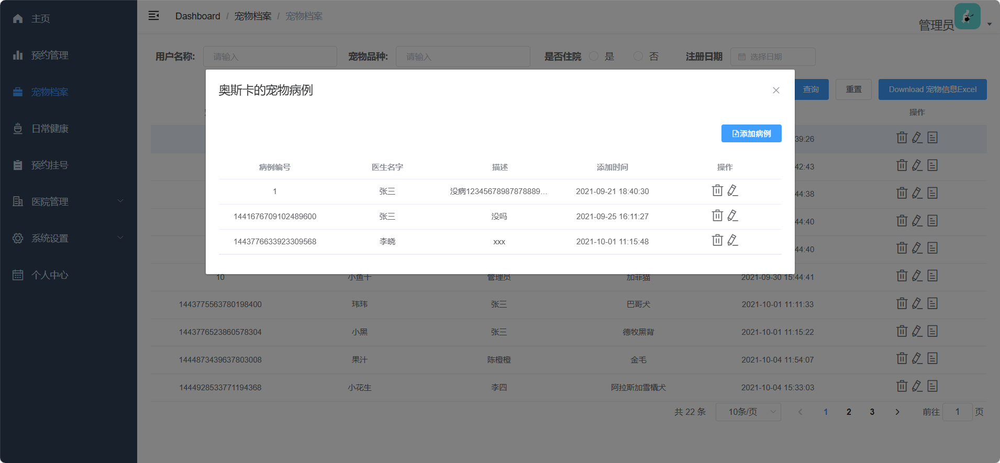
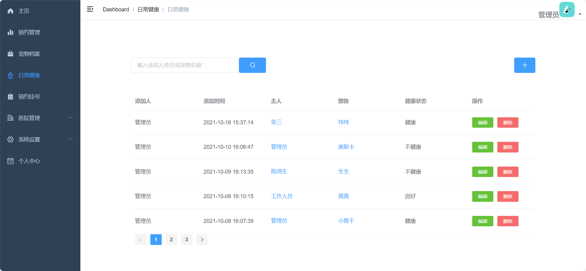
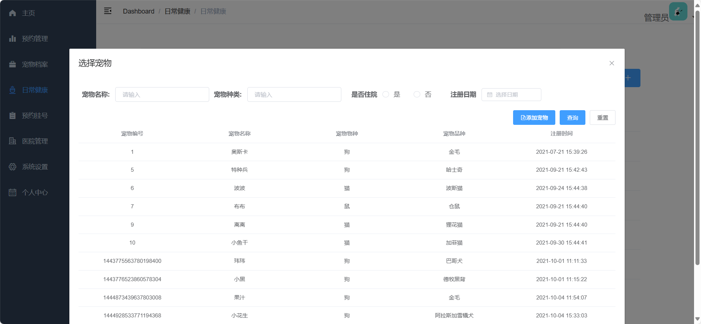
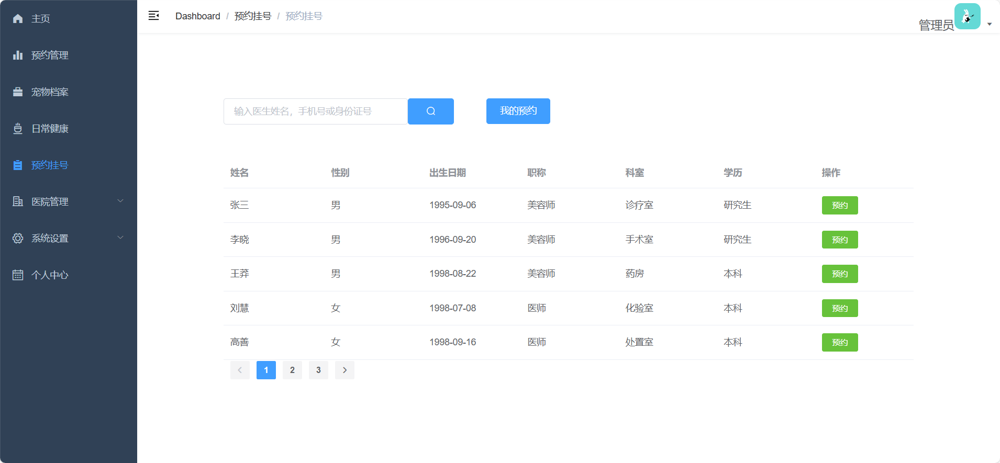
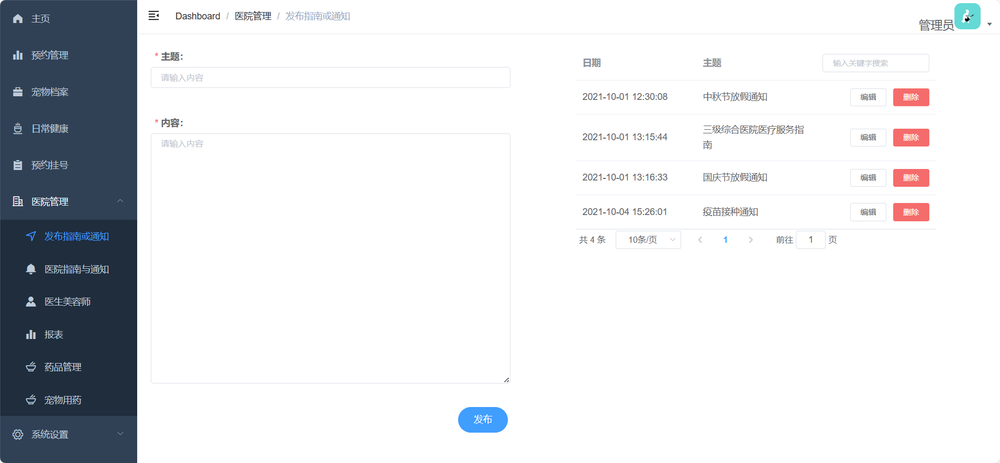

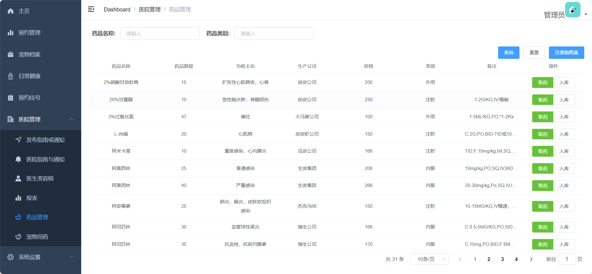
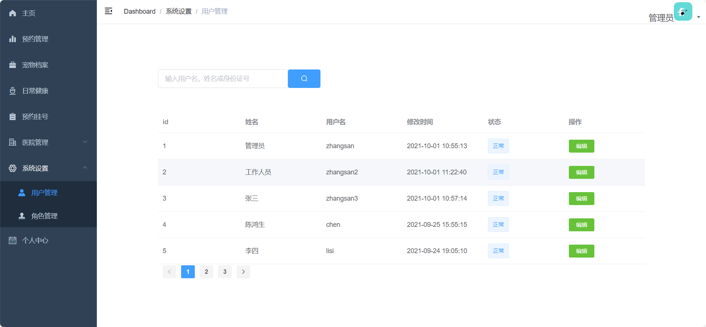
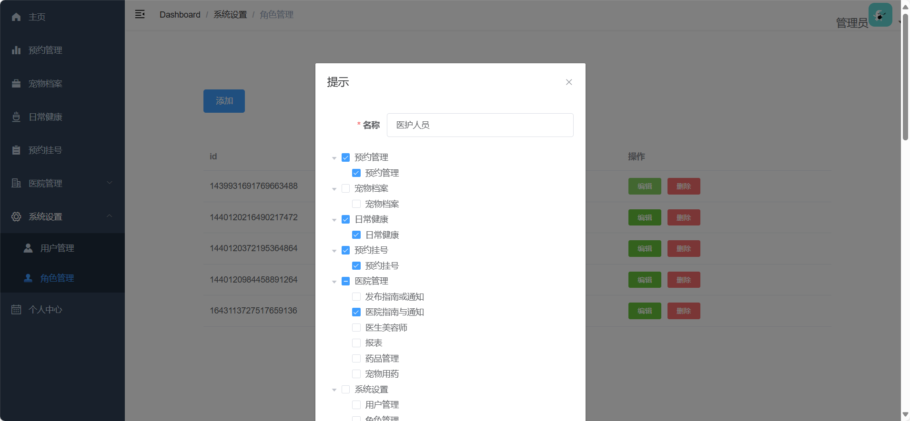
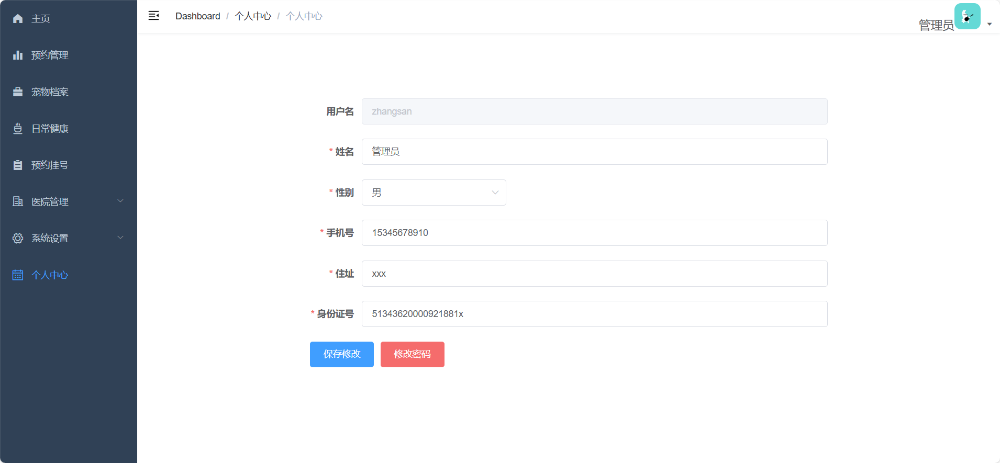

### 环境需求(可免费提供)
- idea/eclipse、jdk-1.8、maven-3.8.6、mysql、node.js

## 有项目修改、安装调试需求 请联系以下

## 获取资源扫☝☝☝

